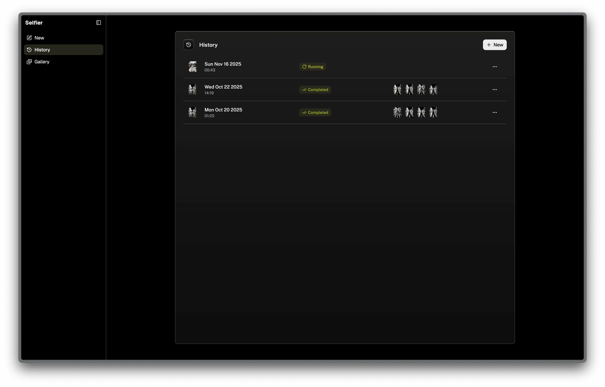
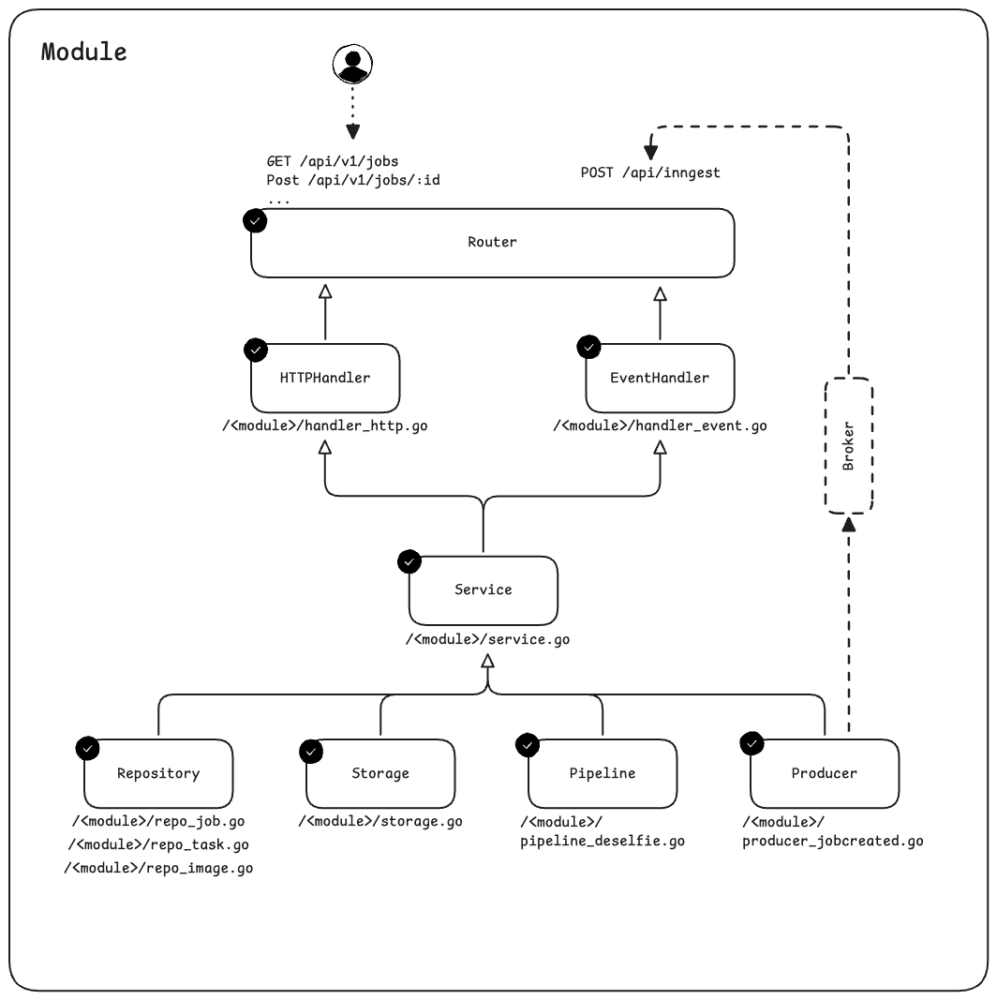
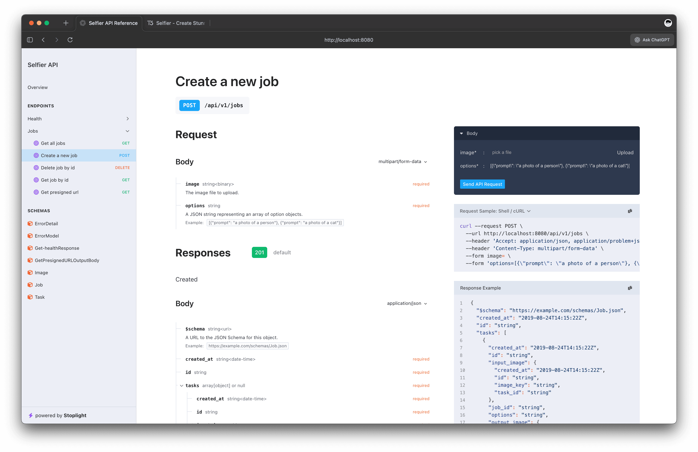

# Selfier - Create Stunning Photo With Your Selfie

An AI-powered image processing application that transforms selfies into natural-looking photos taken from a distance. Perfect for solo travelers who want professional-looking travel photos without a selfie stick or asking strangers for help.



## Overview

Selfier converts close-up selfie photos into images that appear as if they were taken by someone else from a distance. Using advanced AI diffusion models, the service transforms the perspective, composition, and framing to create natural travel photography. The application follows hexagonal architecture principles.

| Input Image                            | Output Image                                              |
| -------------------------------------- | --------------------------------------------------------- |
|  |  |
|  |  |
|  |  |
|  |  |
|  |  |

## How It Works

1. **Upload**: Solo traveler uploads a selfie photo
2. **Storage**: Image is uploaded to S3 and a job record is created
3. **Event**: Job creation triggers an Inngest event
4. **Processing**: Modal function downloads the selfie, runs AI model to transform it into a non-selfie perspective, and uploads result
5. **Completion**: Job status is updated with presigned URLs to results
6. **Display**: Frontend displays original selfie and transformed travel photo side-by-side

### Architecture



- **Backend API**: Go service with Huma v2 framework for OpenAPI-first REST endpoints
- **Frontend**: Next.js 15 with React 19, Tailwind CSS, and shadcn/ui components
- **AI Processing**: Modal Labs for serverless GPU inference using diffusion models
- **Event Processing**: Inngest for async job orchestration
- **Database**: PostgreSQL with GORM ORM and Prisma
- **Storage**: AWS S3 for image uploads and results

## Tech Stack

### Backend

- **Go 1.25.1**
- **Huma v2** - OpenAPI framework
- **GORM** - Database ORM
- **PostgreSQL** - Primary database
- **AWS SDK v2** - S3 integration
- **Inngest Go SDK** - Event orchestration
- **Viper** - Configuration management
- **slog** - Structured logging

### Frontend

- **Next.js 15** with App Router
- **React 19**
- **TypeScript**
- **Tailwind CSS 4**
- **shadcn/ui** - Component library
- **openapi-fetch** - Type-safe API client

### AI/ML

- **Modal Labs** - Serverless GPU platform
- **Qwen Image Edit 2509** - Diffusion model (4-bit quantized)
- **Diffusers** - Hugging Face library
- **PyTorch** - Deep learning framework

## Project Structure

```
selfier/
├── cmd/
│   └── api/              # Application entry point
├── internal/
│   └── modules/          # Business logic modules
│       ├── job/          # Job processing domain
│       └── ...
├── pkg/                  # Reusable packages
│   ├── config/           # Configuration management
│   ├── database/         # Database connection
│   ├── logger/           # Structured logging
│   ├── router/           # HTTP router setup
│   └── aws/              # AWS S3 client
├── modal/                # Modal AI processing functions
│   ├── deselfie.py       # Main deselfie pipeline
│   └── mock_deselfie.py  # Local testing mock
├── web/                  # Next.js frontend
│   ├── src/
│   │   ├── app/          # App router pages
│   │   ├── components/   # React components
│   │   └── lib/          # Utilities
│   └── prisma/           # Database schema
├── bin/                  # Compiled binaries
├── tmp/                  # Temporary files (Air)
├── .env                  # Environment variables
├── .air.toml             # Hot reload config
├── Makefile              # Development commands
└── go.mod                # Go dependencies
```

## Getting Started

### Prerequisites

#### Option 1: Docker

- Docker 20.10+
- Docker Compose v2.0+
- PostgreSQL database (can be deployed manually or use managed service)
- AWS account (for S3 storage)
- Modal account (for AI processing)

#### Option 2: Local Development

- Go 1.25+
- Node.js 18+
- PostgreSQL database (can be deployed manually or use managed service)
- AWS account (for S3 storage)
- Modal account (for AI processing)

### Environment Setup

1. Copy the example environment file:

```bash
cp .env.example .env
```

2. Configure the following required variables:

```env
# Server
PRIMARY_ENV=development
SERVER_PORT=8080

# Database - PostgreSQL
DATABASE_HOST=your_postgres_host
DATABASE_PORT=5432
DATABASE_USER=your_db_user
DATABASE_PASSWORD=your_db_password
DATABASE_NAME=your_db_name

# AWS S3 (Required)
AWS_REGION=ap-southeast-1
AWS_ACCESS_KEY_ID=your_access_key
AWS_SECRET_ACCESS_KEY=your_secret_key
AWS_UPLOAD_BUCKET=your-bucket-name

# Authentication (Required)
AUTH_SECRET_KEY=your-jwt-secret-key
```

### Installation

#### Option 1: Docker Installation

The easiest way to run the full stack with all dependencies:

```bash
# Build and start all services (Backend, Frontend)
docker-compose up --build

# Or run in detached mode
docker-compose up -d

# View logs
docker-compose logs -f

# Stop all services
docker-compose down

# Stop and remove volumes (clean slate)
docker-compose down -v
```

Services will be available at:

- **Backend API**: http://localhost:8080
- **Frontend**: http://localhost:3000

#### Option 2: Local Development Installation

```bash
make dev
```

#### Modal (AI Processing)

```bash
# Install Modal CLI
pip install modal

# Authenticate
modal token new

# Deploy the deselfie function
modal deploy modal/deselfie.py
```

> **Note**: The TypeScript API types are auto-generated from the OpenAPI spec when running `make dev`. You don't need to generate them manually.

### Running the Application

#### Docker Mode

```bash
# Start all services
docker-compose up

# Access the application
# Frontend: http://localhost:3000
# Backend: http://localhost:8080
# API Docs: http://localhost:8080/docs
```

#### Local Development Mode (All Services)

```bash
make dev
```

This single command will:

1. Start the Go backend with hot reload (Air) on port 8080
2. Wait for the backend to be ready
3. Start the Inngest dev server at http://localhost:8080/api/inngest
4. Auto-generate TypeScript API types from OpenAPI spec to `web/src/lib/api-types.ts`
5. Start the Next.js frontend with Turbo

#### Individual Services

**Backend Only:**

```bash
# With hot reload
air

# Or standard go run
go run cmd/api/main.go
```

**Frontend Only:**

```bash
cd web
npm run dev
```

**Inngest Dev Server:**

```bash
npx inngest-cli@latest dev --no-discovery -u http://localhost:8080/api/inngest
```

## API Documentation



Once the backend is running, visit:

- **OpenAPI Docs**:
  &nbsp;&nbsp;&nbsp;&nbsp;http://localhost:8080/docs
- **OpenAPI Spec**:
  &nbsp;&nbsp;&nbsp;&nbsp;http://localhost:8080/openapi.json

### Key Endpoints

- `POST /api/v1/jobs`
  &nbsp;&nbsp;&nbsp;&nbsp;Create new image processing job
- `GET /api/v1/jobs`
  &nbsp;&nbsp;&nbsp;&nbsp;List all jobs
- `GET /api/v1/jobs/{id}`
  &nbsp;&nbsp;&nbsp;&nbsp;Get job details
- `DELETE /api/v1/jobs/{id}`
  &nbsp;&nbsp;&nbsp;&nbsp;Delete job
- `GET /api/v1/jobs/{job_id}/tasks/{task_id}/images/{image_id}`
  &nbsp;&nbsp;&nbsp;&nbsp;Get processed image (presigned URL)
- `GET /api/v1/health`
  &nbsp;&nbsp;&nbsp;&nbsp;Health check

---

### Selfier API — REST Documentation

#### Overview

The **Selfier API** provides endpoints for creating and managing image-processing jobs. Each job contains one or more tasks, where each task processes the input image with its own set of options.
Processing is asynchronous via **Inngest**, and results are fetched using presigned URLs.

This documentation covers:

- API routes under `/api/v1`
- Request and response formats
- Data models
- Event handling (Inngest)
- Error responses
- Example workflows

---

#### Base URL

```
/api/v1
```

---

### Authentication & Middleware

The API stack includes:

- **AuthMiddleware**
- **RequestIDMiddleware**
- **LoggerMiddleware**
- **CORSMiddleware**

---

### Health Check

##### GET `/api/v1/health`

###### Response

```json
{
  "message": "health check ok"
}
```

---

### Jobs API

#### 1. Create Job

##### POST `/api/v1/jobs`

Content-Type: `multipart/form-data`

**Form Fields**

| Field     | Type          | Required | Description             |
| --------- | ------------- | -------- | ----------------------- |
| `image`   | File          | Yes      | Input image             |
| `options` | string (JSON) | Yes      | Array of option objects |

**Example Response (`201 Created`)**

```json
{
  "body": {
    "id": "052ef2f5-28dd-44e6-8345-e8fc11235d1c",
    "created_at": "2025-11-15T12:00:00Z",
    "tasks": [...]
  }
}
```

---

#### 2. Get All Jobs

##### GET `/api/v1/jobs`

```json
{
  "body": [...]
}
```

---

#### 3. Get Job by ID

##### GET `/api/v1/jobs/{id}`

---

#### 4. Delete Job

##### DELETE `/api/v1/jobs/{id}`

---

#### 5. Get Presigned URL

##### GET `/api/v1/jobs/{job_id}/tasks/{task_id}/images/{image_id}`

---

### Data Models

#### Job

```json
{ "id": "uuid", "created_at": "timestamp", "tasks": [...] }
```

#### Task

```json
{ "id": "uuid", "status": "...", "input_image": {...}, "output_image": null }
```

#### Image

```json
{ "id": "uuid", "task_id": "uuid", "image_key": "storage/path" }
```

---

### Task Status Values

| Status    | Meaning    |
| --------- | ---------- |
| pending   | Created    |
| running   | Processing |
| completed | Done       |
| failed    | Error      |

---

### Inngest Event Processing

##### Topic

```
api/task.created
```

##### Handler

```
jobEventHandler.TaskCreated
```

##### Event Flow

1. Task stored
2. Event emitted
3. Worker receives
4. Pipeline runs
5. Output uploaded
6. Task updated

---

### Error Responses

| Error               | Code | Meaning          |
| ------------------- | ---- | ---------------- |
| record not found    | 404  | Missing resource |
| record conflict     | 409  | Duplicate        |
| internal error      | 500  | Server issue     |
| failed to read file | 400  | Invalid upload   |

---

### Example Workflow

1. Create job
2. Poll job
3. Retrieve output via presigned URL

---

### Developer Notes

Routes registered under:

```go
apiV1 := huma.NewGroup(api, "/api/v1")
```

Inngest handler:

```
/api/inngest
```

---

## Development

### Code Quality

**Backend:**

Pre-commit hooks are configured to run `golangci-lint` and `go fmt ./...`

## Deployment

### Docker Deployment

**Production deployment with Docker:**

```bash
# Build images
docker-compose build

# Run in production mode
PRIMARY_ENV=production docker-compose up -d

# View logs
docker-compose logs -f

# Check service health
docker-compose ps
```

Ensure your production `.env` file has:

- Valid AWS credentials
- Secure `AUTH_SECRET_KEY`
- Production database credentials
- Appropriate CORS origins

**Modal Functions:**

Deploy to Modal:

```bash
modal deploy modal/deselfie.py
```

## TODO

- [ ] **Authentication**: User login/registration system with OAuth
- [ ] **Payment**: Stripe integration with subscription plans
- [ ] **Deployment**: CI/CD pipeline, Kubernetes manifests, ArgoCD GitOps setup
